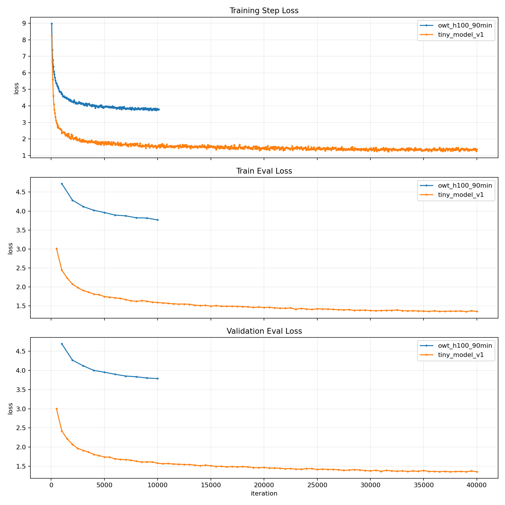
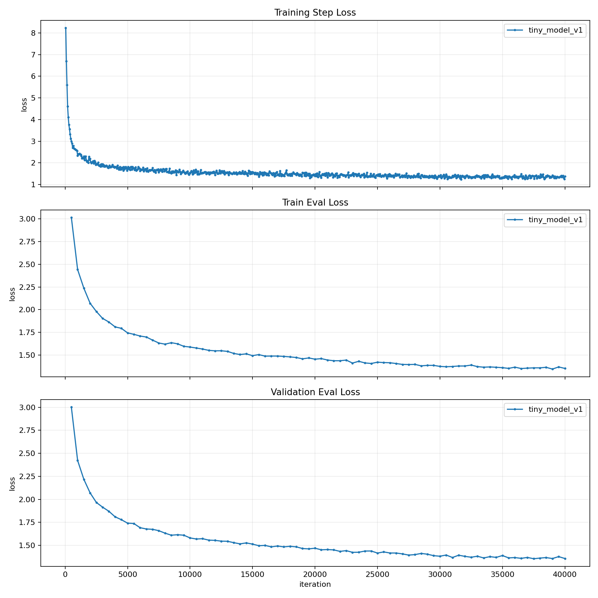
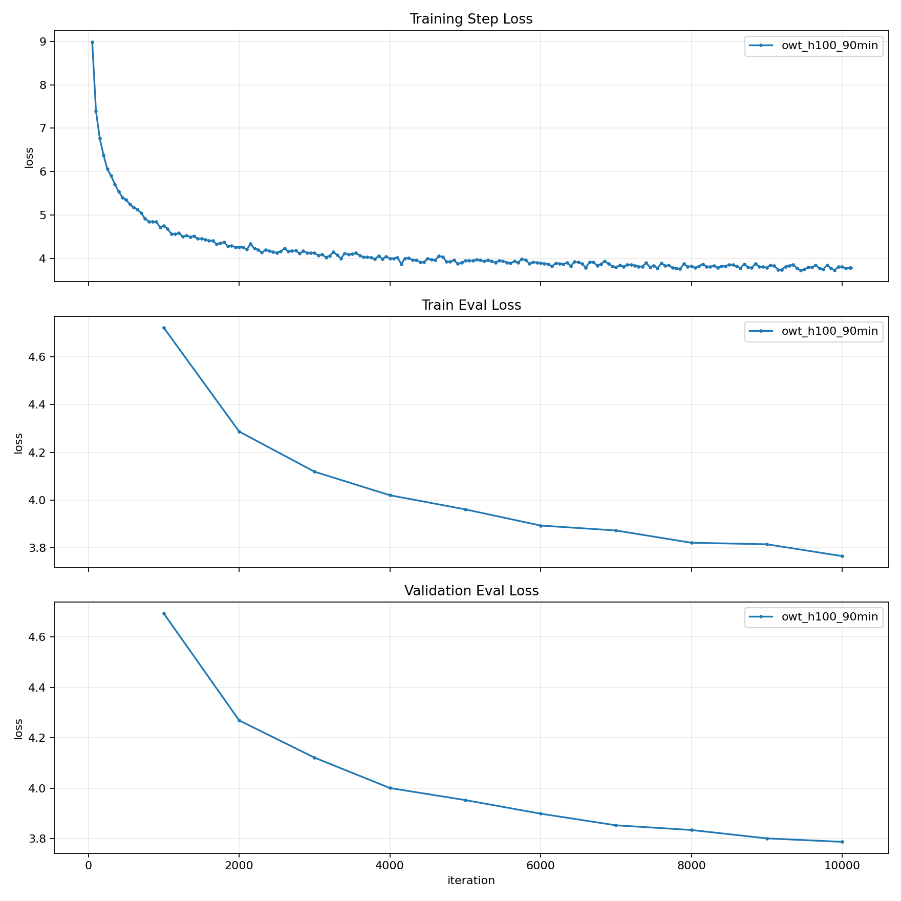

# LLM From Scratch

This repository is my end-to-end implementation of a small GPT-style language model: tokenizer training, model components, optimization, training loops, experiment tracking, decoding, plotting, and a RunPod Serverless deployment path.

The goal was to learn how the moving pieces of modern language models fit together by building them directly instead of treating them as a black box.

## What I Built

- A byte-pair encoding tokenizer with parallel pre-tokenization and learned merge rules.
- A decoder-only Transformer language model in PyTorch.
- Core model layers from scratch, including token embeddings, multi-head self-attention, RoPE, RMSNorm, SwiGLU, linear layers, softmax, and cross-entropy loss.
- Optimizers and training utilities, including AdamW, SGD, gradient clipping, cosine learning-rate scheduling, checkpoint save/load, and CSV metric logging.
- Autoregressive text generation with temperature and top-p sampling.
- Experiment plotting for loss curves.
- A RunPod Serverless Docker deployment for the OpenWebText-trained model.

## What I Learned

This project helped me connect the theory of LLMs to the engineering details that make training actually work:

- How BPE tokenizers turn raw text into stable integer sequences for language modeling.
- How decoder-only Transformers combine embeddings, attention, feed-forward layers, normalization, residual connections, and positional information.
- Why training stability depends on details like initialization, AdamW hyperparameters, gradient clipping, warmup, and learning-rate decay.
- How to structure training runs so they can be resumed, inspected, compared, and deployed.
- How validation loss, train loss, and learning-rate curves tell different parts of the training story.
- What changes when moving from a small local experiment to a larger GPU-backed training run and then to inference serving.

## Models Trained

### `tiny_model_v1`

A smaller model trained on the tiny dataset/tokenizer setup.

| Setting | Value |
| --- | --- |
| Parameters | 22.70M |
| Vocabulary size | 10,000 |
| Layers | 4 |
| Model dimension | 512 |
| Attention heads | 16 |
| Context length | 256 |
| Batch size | 32 |
| Training iterations | 40,000 |
| Final train eval loss | 1.3524 |
| Final validation eval loss | 1.3564 |

This run was useful for validating the full training stack quickly: tokenizer output, batching, model forward/backward passes, checkpointing, eval, and metric logging.

### `owt_h100_90min`

A larger model trained on tokenized OpenWebText for about 90 minutes on an H100.

| Setting | Value |
| --- | --- |
| Parameters | 105.79M |
| Vocabulary size | 32,000 |
| Layers | 8 |
| Model dimension | 768 |
| Attention heads | 12 |
| Context length | 256 |
| Batch size | 128 |
| Training time limit | 5,400 seconds |
| Completed iterations | 10,115 |
| Final train eval loss | 3.7660 |
| Final validation eval loss | 3.7875 |

This run was the main scale-up experiment. It uses a larger vocabulary, wider model, more layers, stronger weight decay, and OpenWebText tokenized data. The checkpoint is packaged for RunPod Serverless inference.

## Repository Layout

```text
src/
  bpe_tokenizer/        BPE tokenizer training and tokenization
  models/               Transformer model components
  optim/                Optimizers, LR schedule, gradient clipping
  training/             Data loading, checkpointing, training loop
  decoding.py           Interactive generation script

experiments/
  tiny_model_v1/        Tiny model config and metrics
  owt_h100_90min/       OpenWebText H100 run config and metrics
  metric_plots/         Per-experiment loss plots

deploy/
  runpod_owt_h100_90min/ Docker and RunPod Serverless deployment files

scripts/
  plot_metrics.py       Combined and per-model metric plots
```

## Plotting Metrics

Generate the combined comparison plot and one plot per experiment:

```bash
uv run --with matplotlib python scripts/plot_metrics.py
```

### Combined Experiment Comparison



### Per-Model Curves





Outputs:

- `experiments/metrics.png`
- `experiments/metric_plots/tiny_model_v1.png`
- `experiments/metric_plots/owt_h100_90min.png`

## Deployment

The `deploy/runpod_owt_h100_90min` folder packages the `owt_h100_90min` model for RunPod Serverless. It includes a Dockerfile, handler, test payload, and helper script for creating a RunPod endpoint.

See `deploy/runpod_owt_h100_90min/README.md` for build, Hugging Face upload, and endpoint creation instructions.

## Notes

This is a learning-first implementation. Many components that would normally come from PyTorch or production libraries were implemented directly so I could understand the mechanics. The result is a compact LLM training stack that can train small models, track experiments, generate text, and deploy a trained checkpoint for inference.
